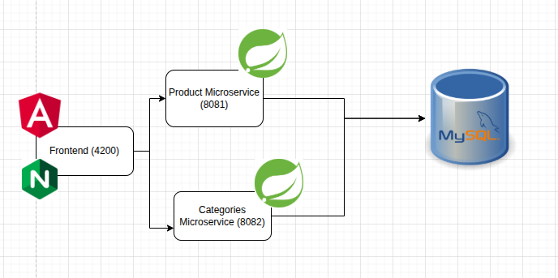
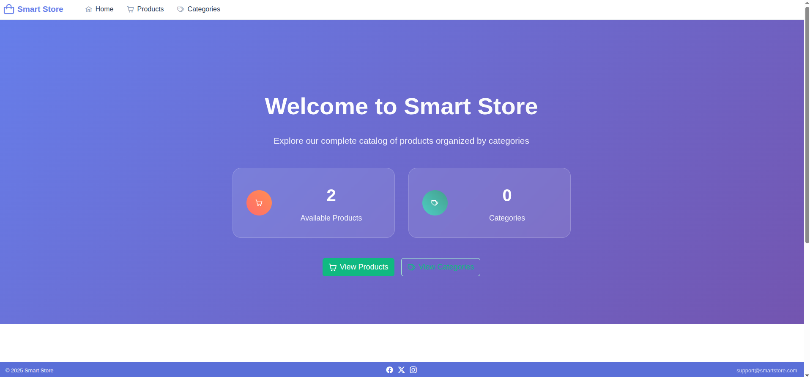
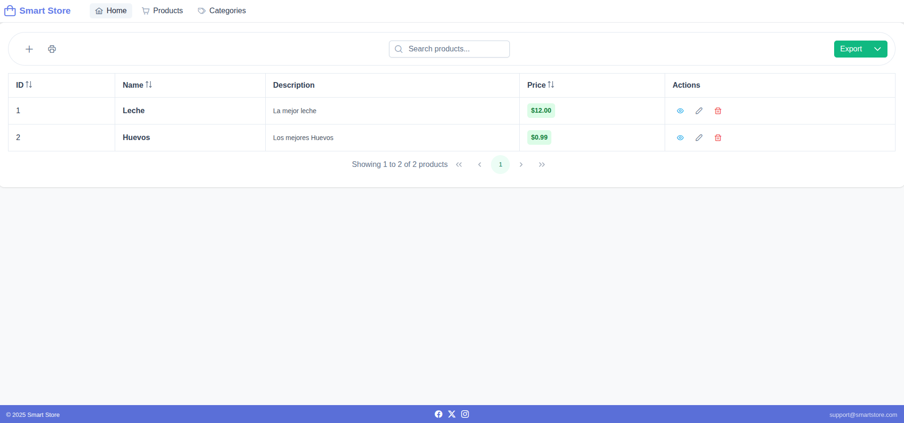
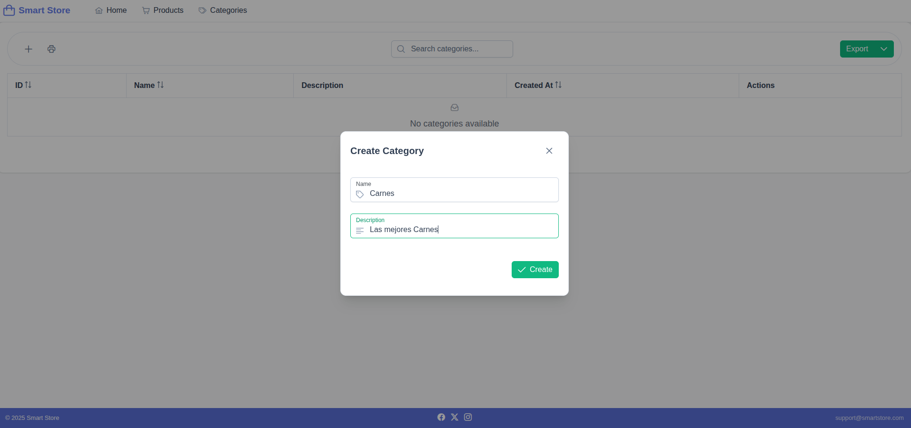
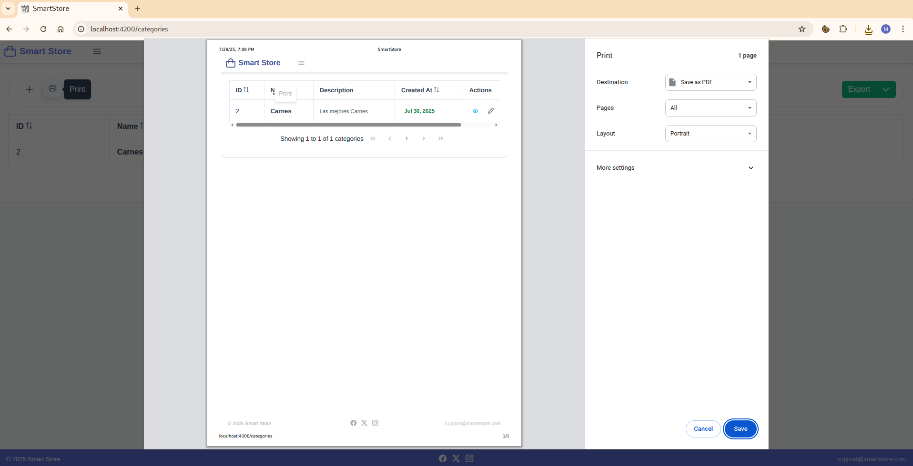

# Basic Microservice App - Smart Store

## Introduction

This project is a **microservices-based e-commerce application** built with modern web technologies. The Smart Store application demonstrates a distributed architecture pattern where different business functionalities are separated into independent, scalable services.

The application consists of:

- **Categories Microservice**: A Spring Boot service that manages product categories (running on port 8082)
- **Products Microservice**: A Spring Boot service that handles product management (running on port 8081)  
- **Frontend Application**: An Angular-based web interface called "Smart Store" that provides a user-friendly interface for customers (running on port 4200)
- **Database**: MySQL database for persistent data storage

All services are containerized using Docker and orchestrated with Docker Compose, making the application easy to deploy and scale. The architecture follows microservices best practices, with each service being independently deployable, maintainable, and scalable.

This project serves as a practical example of how to build a distributed system using popular Java and JavaScript frameworks, demonstrating concepts like service communication, database integration, and modern frontend development with Angular 19 and PrimeNG components.


## Technologies Used

### Backend Technologies
- **Java 17**: Modern LTS version of Java for enterprise applications
- **Spring Boot 3.4.7**: Main framework for building microservices
- **Spring Data JPA**: For database abstraction and ORM functionality
- **Spring Web**: For building RESTful web services
- **Spring Boot Validation**: For input validation and data integrity
- **Spring Boot DevTools**: For development productivity (hot reloading)
- **MySQL Connector/J**: JDBC driver for MySQL database connectivity

### Frontend Technologies
- **Angular 19**: Latest version of the Angular framework
- **TypeScript 5.6.2**: Strongly typed superset of JavaScript
- **PrimeNG 20.0.1**: Rich UI component library for Angular
- **PrimeUI/X Themes 1.2.2**: Theming system for PrimeNG components
- **RxJS 7.8.0**: Reactive programming library for handling asynchronous operations
- **jsPDF 3.0.1**: Client-side PDF generation
- **jsPDF-AutoTable 5.0.2**: Plugin for generating PDF tables
- **File-Saver 2.0.5**: Library for saving files on client-side

### Database
- **MySQL**: Relational database management system for data persistence

### DevOps & Deployment
- **Docker**: Containerization platform for all services
- **Docker Compose**: Multi-container Docker application orchestration
- **Nginx**: Web server for serving the Angular frontend in production

### Development Tools
- **Angular CLI 19.0.6**: Command-line interface for Angular development
- **Maven**: Build automation and dependency management tool for Java projects
- **Yarn**: Fast, reliable, and secure dependency management for Node.js projects

### Architecture Patterns
- **Microservices Architecture**: Distributed system design
- **RESTful APIs**: HTTP-based service communication
- **Reactive Forms**: Angular's model-driven approach to handling form inputs
- **Component-Based Architecture**: Modular frontend development

## Features

### Product Management
- **Complete CRUD Operations**: Create, Read, Update, and Delete products
- **Product Information**: Manage product name, description, and pricing
- **Modal-Based Interface**: User-friendly modal dialogs for product operations
- **Form Validation**: Comprehensive client-side validation with custom validators
- **View-Only Mode**: Read-only product details view for information display

### Category Management
- **Category CRUD**: Full lifecycle management of product categories
- **Category Metadata**: Store category names, descriptions, and creation timestamps
- **Form Validation**: Input validation with length and format constraints
- **Modal Interface**: Consistent modal-based user experience

### Data Export & Reporting
- **PDF Export**: Generate professional PDF reports of product listings
- **CSV Export**: Export product data to CSV format for external processing
- **Automatic File Naming**: Timestamped file exports for organization
- **Data Formatting**: Properly formatted export data with headers

### User Interface & Experience
- **Modern UI Design**: Built with PrimeNG components 
- **Responsive Layout**: Mobile-friendly interface that adapts to different screen sizes
- **Navigation System**: Intuitive navbar with routing between different sections
- **Toast Notifications**: Real-time feedback for user actions and system events
- **Confirmation Dialogs**: Safety prompts for destructive operations (delete actions)

### Data Management & Validation
- **Form Validation**: Multi-level validation including:
  - Required field validation
  - Minimum/maximum length constraints
  - Numeric validation for pricing
  - Custom whitespace validation
  - Price minimum value validation ($0.01)
- **Real-time Error Display**: Instant feedback on form validation errors
- **Data Integrity**: Consistent data structure across frontend and backend

### Backend API Features
- **RESTful Microservices**: Two independent services for Products and Categories
- **Database Integration**: MySQL database with JPA/Hibernate ORM
- **Input Validation**: Server-side validation using Spring Boot Validation
- **CORS Support**: Cross-origin resource sharing for frontend communication
- **Development Tools**: Hot reload and development utilities

### DevOps & Deployment
- **Containerization**: All services containerized with Docker
- **Orchestration**: Docker Compose for multi-service deployment
- **Environment Configuration**: Environment-based configuration management
- **Service Discovery**: Internal network communication between containers
- **Database Persistence**: Persistent MySQL storage with proper networking

### Development Features
- **Hot Reload**: Development-time automatic reloading for both frontend and backend
- **Error Handling**: Comprehensive error handling with user-friendly messages
- **Logging**: Console logging for debugging and monitoring
- **TypeScript Support**: Strong typing throughout the Angular application
- **Reactive Programming**: RxJS observables for handling asynchronous operations

## Architecture Overview


The Smart Store application is designed using a microservices architecture, where each service is responsible for a specific business capability. The architecture consists of the following components:




## Endpoints

### Products Microservice (Port 8081)

#### Get All Products
- **Endpoint**: `GET /api/products`
- **Description**: Retrieve all products from the database
- **Response**: Array of product objects

```bash
curl -X GET http://localhost:8081/api/products \
  -H "Content-Type: application/json"
```

#### Get Product by ID
- **Endpoint**: `GET /api/products/{id}`
- **Description**: Retrieve a specific product by its ID
- **Parameters**: `id` (Long) - Product ID
- **Response**: Product object or 404 if not found

```bash
curl -X GET http://localhost:8081/api/products/1 \
  -H "Content-Type: application/json"
```

#### Create Product
- **Endpoint**: `POST /api/products`
- **Description**: Create a new product
- **Request Body**: Product object (name, description, price)
- **Response**: Created product with generated ID (201 Created)

```bash
curl -X POST http://localhost:8081/api/products \
  -H "Content-Type: application/json" \
  -d '{
    "name": "Sample Product",
    "description": "This is a sample product description",
    "price": 29.99
  }'
```

#### Update Product (Full Update)
- **Endpoint**: `PUT /api/products/{id}`
- **Description**: Update all fields of an existing product
- **Parameters**: `id` (Long) - Product ID
- **Request Body**: Complete product object
- **Response**: Updated product object or 404 if not found

```bash
curl -X PUT http://localhost:8081/api/products/1 \
  -H "Content-Type: application/json" \
  -d '{
    "name": "Updated Product Name",
    "description": "Updated product description",
    "price": 39.99
  }'
```

#### Update Product (Partial Update)
- **Endpoint**: `PATCH /api/products/{id}`
- **Description**: Update specific fields of an existing product
- **Parameters**: `id` (Long) - Product ID
- **Request Body**: Partial product object (only fields to update)
- **Response**: Updated product object or 404 if not found

```bash
curl -X PATCH http://localhost:8081/api/products/1 \
  -H "Content-Type: application/json" \
  -d '{
    "price": 49.99
  }'
```

#### Delete Product
- **Endpoint**: `DELETE /api/products/{id}`
- **Description**: Delete a product by its ID
- **Parameters**: `id` (Long) - Product ID
- **Response**: 204 No Content on success

```bash
curl -X DELETE http://localhost:8081/api/products/1 \
  -H "Content-Type: application/json"
```

### Categories Microservice (Port 8082)

#### Get All Categories
- **Endpoint**: `GET /api/categories`
- **Description**: Retrieve all categories from the database
- **Response**: Array of category objects

```bash
curl -X GET http://localhost:8082/api/categories \
  -H "Content-Type: application/json"
```

#### Get Category by ID
- **Endpoint**: `GET /api/categories/{id}`
- **Description**: Retrieve a specific category by its ID
- **Parameters**: `id` (Long) - Category ID
- **Response**: Category object or 404 if not found

```bash
curl -X GET http://localhost:8082/api/categories/1 \
  -H "Content-Type: application/json"
```

#### Create Category
- **Endpoint**: `POST /api/categories`
- **Description**: Create a new category
- **Request Body**: Category object (name, description)
- **Response**: Created category with generated ID and timestamp (201 Created)

```bash
curl -X POST http://localhost:8082/api/categories \
  -H "Content-Type: application/json" \
  -d '{
    "name": "Sample Category",
    "description": "This is a sample category description"
  }'
```

#### Update Category (Full Update)
- **Endpoint**: `PUT /api/categories/{id}`
- **Description**: Update all fields of an existing category
- **Parameters**: `id` (Long) - Category ID
- **Request Body**: Complete category object
- **Response**: Updated category object or 404 if not found

```bash
curl -X PUT http://localhost:8082/api/categories/1 \
  -H "Content-Type: application/json" \
  -d '{
    "name": "Updated Category Name",
    "description": "Updated category description"
  }'
```

#### Update Category (Partial Update)
- **Endpoint**: `PATCH /api/categories/{id}`
- **Description**: Update specific fields of an existing category
- **Parameters**: `id` (Long) - Category ID
- **Request Body**: Partial category object (only fields to update)
- **Response**: Updated category object or 404 if not found

```bash
curl -X PATCH http://localhost:8082/api/categories/1 \
  -H "Content-Type: application/json" \
  -d '{
    "description": "Updated description only"
  }'
```

#### Delete Category
- **Endpoint**: `DELETE /api/categories/{id}`
- **Description**: Delete a category by its ID
- **Parameters**: `id` (Long) - Category ID
- **Response**: 204 No Content on success

```bash
curl -X DELETE http://localhost:8082/api/categories/1 \
  -H "Content-Type: application/json"
```

### Data Models

#### Product Model
```json
{
  "id": 1,
  "name": "Product Name",
  "description": "Product description",
  "price": 29.99
}
```

**Validation Rules:**
- `name`: Required, minimum 3 characters, maximum 50 characters, cannot be blank
- `description`: Required, maximum 255 characters, cannot be blank
- `price`: Required, minimum value 0.01

#### Category Model
```json
{
  "id": 1,
  "name": "Category Name",
  "description": "Category description",
  "createdAt": "2025-07-29T10:15:30"
}
```

**Validation Rules:**
- `name`: Required, minimum 3 characters, maximum 50 characters, cannot be blank
- `description`: Required, maximum 255 characters, cannot be blank
- `createdAt`: Automatically generated timestamp (read-only)

### Error Responses

#### 400 Bad Request
```json
{
  "timestamp": "2025-07-29T10:15:30.123+00:00",
  "status": 400,
  "error": "Bad Request",
  "message": "Validation failed",
  "path": "/api/products"
}
```

#### 404 Not Found
```json
{
  "timestamp": "2025-07-29T10:15:30.123+00:00",
  "status": 404,
  "error": "Not Found",
  "message": "Product not found",
  "path": "/api/products/999"
}
```

## Frontend Overview

The Smart Store frontend provides an intuitive and modern user interface for managing products and categories. Built with Angular 19 and PrimeNG components, the application offers a responsive design that works seamlessly across different devices.

### Home Page
The landing page provides a welcoming interface with navigation to different sections of the application.



### Products Management
The products section allows users to view, create, edit, and delete products. Features include data tables with sorting, filtering, and export capabilities.



### Categories Management
The categories section provides full CRUD operations for managing product categories with a clean, table-based interface.



### Export and Print Features
The application includes comprehensive export functionality, allowing users to generate PDF and CSV reports of their data.



## Getting Started

To get started with the Smart Store application, follow these steps:

1. **Clone the Repository**
```bash
git clone https://github.com/Cotbert2/BasicMicroServiceApp.git
cd BasicMicroServiceApp
```

2. **Run docker-compose**
Ensure you have Docker and Docker Compose installed. Then run:


```bash
docker-compose up --build
```

Or (it depends on your docker-compose version):

```bash
docker compose up --build
```


## Future Enhancements
- **Api Gateway**: Implement an API gateway for unified access to microservices
- **Authentication & Authorization**: Add user authentication and role-based access control